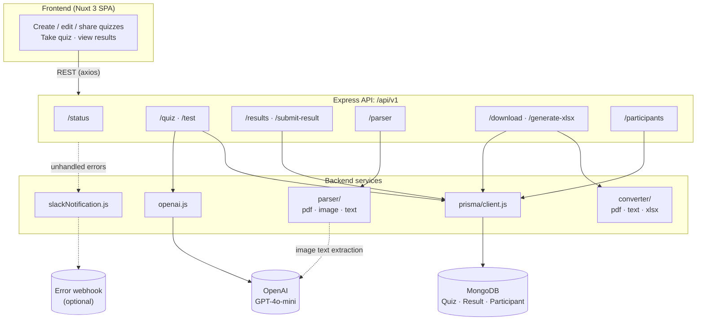

# Jachai AI Quiz Maker

[](https://nuxt.com)
[](https://vuejs.org)
[](https://expressjs.com)
[](https://www.prisma.io)
[](https://platform.openai.com)
[](#quick-start)
[](LICENSE)
[](https://riverborn.com)

**An AI quiz maker that turns text, PDFs, documents or images into a
multiple-choice quiz, lets people take it through a shareable link, and
scores and exports the results.**

Jachai is the core engine behind Riverborn's quiz products. It has a Nuxt 3
web app for creating and managing quizzes and an Express API that calls
OpenAI (GPT-4o-mini) to write the questions, stores quizzes and results in
MongoDB through Prisma, and exports quizzes and results to PDF, plain text
and Excel. It ships without a login system: accounts, billing and admin
dashboards are meant to sit on top of it (see
[Adding real accounts](#adding-real-accounts)).

> [!NOTE]
> **Built by [Riverborn Limited](https://riverborn.com)**, an AI solutions
> company from Dhaka, Bangladesh. We build agentic AI, generative AI and
> conversational AI (voice, chat and RAG). If you need help building an
> AI-powered learning or assessment product,
> **[book a call](https://riverborn.com/#book)** or email
> **[hello@riverborn.com](mailto:hello@riverborn.com)**.

## Table of contents

- [Features](#features)
- [How it works](#how-it-works)
- [Tech stack](#tech-stack)
- [Quick start](#quick-start)
- [Configuration](#configuration)
- [API reference](#api-reference)
- [Data model](#data-model)
- [Project layout](#project-layout)
- [Limitations and known issues](#limitations-and-known-issues)
- [About Riverborn](#about-riverborn)
- [License](#license)

## Features

- **AI quiz generation.** Paste text or upload a file and get a quiz with a
  title, questions, options and answer key, generated by GPT-4o-mini. You
  choose the difficulty (easy, medium, hard), the number of questions (10 to
  50), options per question (4, 6 or 8) and whether questions have one or
  several correct answers. Questions are written in the language of the
  source text.
- **Document and image parsing.** Upload PDF, image (PNG, JPEG, GIF, WebP),
  TXT, MD, CSV, RTF, DOCX or ODT files (up to 10 MB). PDFs are read with
  `pdf-parse`, other documents with `textract`, and images are sent to
  GPT-4o-mini for text extraction. Files go straight to the backend as
  `multipart/form-data`; no external storage service is needed.
- **Edit before sharing.** Review and edit generated questions, options and
  answers, and set a time limit, marks per question and negative marking.
- **Shareable quiz link.** Participants open a public link, fill in the
  details you ask for (name, email, roll, phone, department, session or
  address), and take the quiz with a timer. The API strips the answer key
  from the quiz it sends to participants.
- **Automatic scoring.** Answers are scored against the answer key on the
  server, with optional negative marking. The participant's phone number or
  email (or, if neither is collected, the browser's local ID) is used as an
  identifier to block repeat attempts at the same quiz.
- **Results control.** Show the score to participants right after they
  submit, or hide it.
- **Exports.** Download a quiz as PDF or plain text (with or without
  answers), a single submission as PDF, and all submissions for a quiz as an
  Excel (XLSX) sheet.
- **No account needed.** The web app creates a random local creator ID in the
  browser so "my quizzes" works without a sign-in.

## How it works



1. **Create.** The web app sends source text, or first uploads a file to
   `POST /parser/upload` to extract its text, then calls `POST /quiz` with the
   quiz settings. The backend builds a system prompt from those settings,
   asks GPT-4o-mini for a JSON quiz, and saves it to MongoDB.
2. **Share.** Each quiz has a public link (`/test/<quizId>` in the web app).
   The page loads the quiz from `GET /test/:quizId`, which removes the
   answers.
3. **Take.** The participant enters their details (`POST /participants`),
   starts an attempt (`POST /submit-result`) and submits answers
   (`PUT /results/:resultId`). The server checks the time limit (plus a
   3-minute grace period), scores the answers and stores the result.
4. **Review and export.** The quiz owner sees submissions in the web app and
   can export them. PDFs are rendered with headless Chrome/Chromium via
   `puppeteer-core`; XLSX files with ExcelJS.

Unhandled API errors are logged to the console and, if `ERROR_WEBHOOK_URL` is
set, posted to that URL as JSON (`{ message, siteName }`).

## Tech stack

| Layer | Tech |
|---|---|
| Web app | Nuxt 3 (Vue 3, SPA mode), Pinia, Tailwind CSS, axios, vue3-toastify |
| API | Node.js, Express, multer |
| Database | MongoDB through Prisma ORM |
| AI | OpenAI Node SDK, GPT-4o-mini (quiz generation and image text extraction) |
| File parsing | `pdf-parse`, `textract` |
| Export | `puppeteer-core` (PDF), ExcelJS (XLSX) |
| Container | Dockerfile for the backend (Node 18, Chromium, Noto fonts) |

## Quick start

### Prerequisites

- Node.js 18 or newer and Yarn (both apps use `yarn.lock`)
- A MongoDB database. Prisma's MongoDB connector needs a replica set, so use
  MongoDB Atlas or a local replica set.
- An OpenAI API key
- Google Chrome or Chromium installed locally, for PDF export (see
  [Configuration](#configuration))

### 1. Backend

```bash
cd backend
cp .env.example .env      # then fill in the values below
yarn install
yarn generate             # prisma generate
yarn dev                  # http://localhost:3001
```

`yarn dev` sets `NODE_ENV=development`, which is the only mode that loads
`.env`. In production, set the variables in your environment instead.

| Variable | Required | Description |
|---|---|---|
| `DATABASE_URL` | Yes | MongoDB connection string used by Prisma, including the database name |
| `OPENAI_API_KEY` | Yes | OpenAI API key for quiz generation and image text extraction |
| `ALLOWED_ORIGINS` | No | Comma-separated list of origins allowed by CORS. If unset, all origins are allowed |
| `PORT` | No | API port. Defaults to `3001` |
| `ERROR_WEBHOOK_URL` | No | If set, unhandled API errors are POSTed here as JSON. If unset, errors are only logged |

### 2. Frontend

```bash
cd frontend
cp .env.example .env
yarn install
yarn dev                  # http://localhost:3000
```

| Variable | Required | Description |
|---|---|---|
| `VITE_BASE_URL` | Yes | Base URL of the API, including `/api/v1`, for example `http://localhost:3001/api/v1` |
| `VITE_WEBSITE_URL` | No | Link shown to participants after they finish a quiz. Defaults to empty |

Open http://localhost:3000, click **Create Quiz**, paste some text or upload a
file, and generate.

### 3. Docker (backend only)

```bash
cd backend
docker build -t jachai-backend .
docker run -p 3001:3001 -e DATABASE_URL=... -e OPENAI_API_KEY=... jachai-backend
```

The image installs Chromium and a wide set of Noto fonts so PDF exports render
non-Latin scripts.

## Configuration

- **Model.** GPT-4o-mini is set as the default in
  `backend/services/openai.js` and `backend/services/parser/image.js`.
- **Prompt.** The quiz-generation system prompt is in `createQuiz()` in
  `backend/services/openai.js`.
- **Upload limit.** 10 MB per file, set in `backend/api/parser/v1/index.js`.
- **Chrome path for PDF export.** `backend/services/converter/pdf.js` uses a
  fixed path per OS: `/usr/bin/chromium` on Linux,
  `/Applications/Google Chrome.app/...` on macOS and
  `C:\Program Files (x86)\Google\Chrome\Application\chrome.exe` on Windows.
  Edit `getChromeExecutablePath()` if your browser is somewhere else.
- **Brand colours.** Tailwind colours are in `frontend/tailwind.config.js`.

## API reference

All routes are mounted under `/api/v1`. None of them require authentication.

| Method | Route | Description |
|---|---|---|
| GET | `/status` | Health check, returns `ok` |
| POST | `/quiz` | Generate a quiz from text with OpenAI and save it |
| GET | `/quiz` | List quizzes (`userId`, `limit`, `sorting`, `pageNumber`) |
| GET | `/quiz/:quizId` | Get one quiz, including answers |
| GET | `/test/:quizId` | Get one quiz for a participant, with answers removed |
| PUT | `/quiz/:quizId` | Update a quiz |
| DELETE | `/quiz/:quizId` | Soft-delete a quiz |
| POST | `/parser` | Extract text from a file at a public URL (`{ type, url }`) |
| POST | `/parser/upload` | Extract text from an uploaded file (`multipart/form-data`: `file`, `type`) |
| POST | `/participants` | Create a participant record |
| GET | `/participants/:quizId/:identifier` | Look up a participant and check for a previous attempt |
| POST | `/submit-result` | Start an attempt (`{ quizId, participantId }`) |
| PUT | `/results/:resultId` | Submit answers and score the attempt |
| GET | `/results/:resultId` | Get one result |
| GET | `/results/user/:userId` | List a user's results |
| GET | `/results/quiz/:userId/:quizId` | List results for one quiz |
| DELETE | `/results/:resultId` | Soft-delete a result |
| POST | `/download/pdf` | Export a quiz as PDF (`{ quizId, isIncludeAnswer }`) |
| POST | `/download/text` | Export a quiz as plain text (`{ quizId, isIncludeAnswer }`) |
| GET | `/download/result/:resultId` | Export one result as PDF |
| GET | `/generate-xlsx/:quizId` | Export all results for a quiz as XLSX |

## Data model

Defined in `backend/prisma/schema.prisma`:

- **Quiz**: type, difficulty, question count, options per question, time
  limit, marks, negative marking, result visibility, participant fields to
  collect, the source text, an embedded `questions` array and an opaque
  `userId`.
- **Result**: one participant's attempt: embedded answered questions, scores,
  time taken, a copy of the participant record and an opaque `userId`.
- **Participant**: name, roll, department, session, address and a unique
  `identifier` used to block repeat attempts.

### Adding real accounts

`userId` on quizzes and results is a plain string sent by the client. The
server never checks it. The web app generates a random ID per browser
(`frontend/composables/useLocalCreator.js`). To add real accounts:

1. Put your own auth middleware in front of the routes in
   `backend/api/quiz/v1` and `backend/api/results/v1` (at least `PUT` and
   `DELETE`, and the list routes).
2. Replace `useLocalCreator` and the Pinia store in `frontend/stores` with
   your authenticated user ID.

## Project layout

```
backend/                      Express API
  app.js                      server entry: CORS, routes, error handler
  api/<group>/v1/index.js     route handlers (status, quiz, results, parser, download, participants)
  services/openai.js          quiz generation prompt and OpenAI calls
  services/parser/            PDF, image and text-document text extraction
  services/converter/         PDF, plain-text and XLSX export
  services/prisma/client.js   shared Prisma client
  services/slackNotification.js  optional error webhook
  prisma/schema.prisma        MongoDB data model
  Dockerfile                  backend container with Chromium and fonts
frontend/                     Nuxt 3 web app (SPA)
  pages/                      dashboard, quiz create/edit/list/submissions, public test pages
  components/                 navbar, question editors and viewers, answer sheet, modals
  layouts/                    app, test, default and 404 layouts
  composables/                local creator ID, confetti
  plugins/                    axios client, toast, event bus
  stores/                     Pinia store
  static/                     images and global CSS
  public/                     favicon
LICENSE                       PolyForm Internal Use License 1.0.0
```

## Limitations and known issues

- **No authentication.** Anyone who can reach the API can list, edit or
  delete quizzes and results if they know or guess the IDs. Add your own auth
  before exposing it publicly.
- **Answers are public through the owner route.** `GET /quiz/:quizId` returns
  the answer key and has no auth, so a participant who knows the quiz ID can
  call it directly. The participant page uses `GET /test/:quizId`, which
  strips answers, but you should protect the owner route.
- **Identity is per browser.** The local creator ID lives in `localStorage`.
  Clearing it, or switching browsers, loses access to "my quizzes" in the UI.
- **Generated quizzes need review.** Questions and answer keys come from an
  LLM and can be wrong. The edit screen exists for this.
- **Large inputs.** The full source text is sent to OpenAI in one request, so
  very long documents can hit model context limits or cost more.
- **PDF export needs a local browser** at the fixed paths listed under
  [Configuration](#configuration).
- **`textract` system tools.** Some formats need extra system programs (for
  example `unrtf` for RTF, which the Dockerfile installs).
- **Unix-style dev script.** `yarn dev` in `backend` uses `NODE_ENV=development
  nodemon app.js`, which does not work in the Windows command prompt without
  a tool such as `cross-env`.
- **Leftover code.** `frontend/package.json` still lists a few dependencies the
  current code does not import (for example `socket.io-client`,
  `vue-hotjar-next` and the Chart.js packages), and `frontend/error.vue`
  references a `home-navbar` component that does not exist.
- **Roll number is not saved.** The participant form can ask for a roll
  number, but the web app does not send it to the API, so it shows as `N/A`
  in exports. Email and phone are used only as the participant identifier.
- **No automated tests.**

## About Riverborn

Jachai was built by **[Riverborn Limited](https://riverborn.com)**, an AI
solutions company based in Dhaka, Bangladesh that builds AI systems for
clients worldwide. Jachai is the quiz engine behind our AI quiz and
knowledge-check products, and we are releasing it so teams can run their own.

What we build:

- 🤖 **Agentic AI:** autonomous AI agents and multi-agent systems that
  automate real business workflows
- ✨ **Generative AI:** AI products and MVPs built on large language
  models, taken from prototype to production
- 💬 **Conversational AI:** voice AI agents, chatbots, and RAG systems that
  answer from your own documents and data

Need help with AI? We'd like to hear from you.

- 🌐 Website: [riverborn.com](https://riverborn.com)
- 📅 Book a discovery call: [riverborn.com/#book](https://riverborn.com/#book)
- ✉️ Email: [hello@riverborn.com](mailto:hello@riverborn.com)
- 💼 [LinkedIn](https://www.linkedin.com/company/74964253) · [X](https://x.com/riverbornai) · [Facebook](https://facebook.com/riverbornai) · [GitHub](https://github.com/riverbornai)

## License

Jachai is released under the
**[PolyForm Internal Use License 1.0.0](LICENSE)**.

- You are free to use, run and modify it for your own or your company's
  internal purposes.
- You may not sell it, redistribute it, or offer it to others as a product or
  hosted service.
- For a commercial license, email
  [hello@riverborn.com](mailto:hello@riverborn.com).

See [LICENSE](LICENSE) for the full terms.
